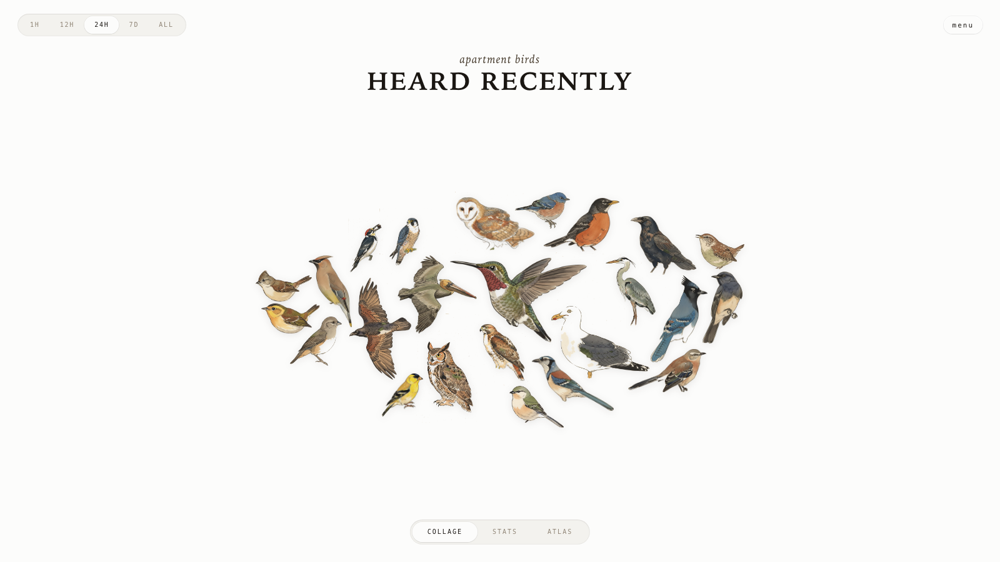

# AvianVisitors-UK

*A live bird collage for UK gardens, powered by BirdNET.*

An acoustic bird monitor for the Raspberry Pi that identifies UK birds in real time and displays them as a growing collage of Japanese kachō-e style illustrations. Built on [BirdNET-Pi](https://github.com/Nachtzuster/BirdNET-Pi) with the [AvianVisitors](https://github.com/Twarner491/AvianVisitors) collage overlay.



---

## What it does

- **Listens** via a USB microphone and identifies bird species using BirdNET machine learning
- **Displays** a live collage of detected birds as Edo-period Japanese woodblock style illustrations
- **Ships with 1245 bundled illustrations** (726 perched + 519 flight poses) covering common UK species
- **On-demand generation**: species without bundled illustrations get a new one generated automatically via free AI image APIs (no API key needed)
- **Runs offline** for all core BirdNET functionality — only the optional illustration generation needs internet

---

## Requirements

| Qty | Item | Notes |
|-----|------|-------|
| 1 | Raspberry Pi (4B / 5 / 3A+ / Zero 2W) | 64-bit OS required |
| 1 | Micro SD card (≥32 GB) | |
| 1 | USB lavalier microphone | Place in a window or mount outside |
| 1 | Pi power supply | |

Optional: an [eBird API key](https://ebird.org/api/keygen) to filter species by region.

---

## Quick install

```bash
ssh <your-username>@birdnet.local
curl -s https://raw.githubusercontent.com/iansblog/AvianVisitors-UK/main/newinstaller.sh | bash
```

This clones the repo, installs BirdNET-Pi, sets up all services, and reboots. Takes 20-40 minutes on a Pi 4.

After reboot:
- **Collage**: `http://birdnet.local/`
- **Admin UI**: `http://birdnet.local/index.php` (menu button → Settings, System, Logs)

---

## Illustrations

The repo ships with a curated set of UK bird illustrations in kachō-e style. To generate additional species or restyle the set:

```bash
# Install illustration tools
python3 -m venv ~/BirdNET-Pi/avian/scripts/.venv
~/BirdNET-Pi/avian/scripts/.venv/bin/pip install -r ~/BirdNET-Pi/avian/scripts/requirements.txt

# Generate illustrations for missing species
~/BirdNET-Pi/avian/scripts/.venv/bin/python3 ~/BirdNET-Pi/avian/scripts/generate_bird.py \
  "Erithacus rubecula" "European Robin" /tmp/robin.png

# Rebuild collage masks after adding new illustrations
python3 ~/BirdNET-Pi/avian/scripts/build_masks.py
```

See [`avian/scripts/README.md`](avian/scripts/README.md) for the full illustration pipeline.

---

## How the collage works

1. Each detection in BirdNET triggers a lookup for a bundled illustration
2. If no bundled illustration exists, the system checks for a cached background-removed photo
3. If nothing is cached, it fetches a Wikipedia photo and removes the background with rembg
4. As a final fallback, it generates a fresh kachō-e illustration via free.ai (no API key needed)
5. The result is cached for instant serving on future requests

The collage JavaScript (`avian/frontend/apt.js`) lays out detected birds on a cream/dark paper background using the pose masks.

---

## Repo layout

```
avian/                  # UK illustration pipeline and collage
├── frontend/           # static HTML/JS/CSS for the collage
├── assets/             # 1245 bundled illustrations + photo-cutout fallbacks
├── api/                # PHP shims (cutout resolver, spectrogram, etc.)
├── scripts/            # illustration generation, mask building, prompt
└── forwarding/         # optional Home Assistant / MQTT / Cloudflare configs
frame/                  # optional e-ink wall display
scripts/                # BirdNET-Pi core scripts (analysis, recording, services)
model/                  # BirdNET model and species labels
templates/              # systemd service templates
```

Everything outside `avian/` and `frame/` is upstream BirdNET-Pi.

---

## Forwarding (optional)

See [`avian/forwarding/`](avian/forwarding/) for recipes to:
- Expose via **Cloudflare Tunnel** for a public HTTPS URL
- Publish detections to **Home Assistant** via REST sensor
- Bridge to **MQTT** for home automation

---

## Credits

This project builds on the work of several open-source projects:

- **[BirdNET-Pi](https://github.com/Nachtzuster/BirdNET-Pi)** by Patrick McGuire — the acoustic bird monitoring platform (CC-BY-NC-SA-4.0)
- **[AvianVisitors](https://github.com/Twarner491/AvianVisitors)** by Twarner491 — the live bird collage overlay
- **[BirdNET](https://github.com/kahst/BirdNET-Analyzer)** by Stefan Kahl — the bird sound classification framework (Cornell Lab of Ornithology)
- **[rembg](https://github.com/danielgatis/rembg)** — background removal for photo cutouts
- **[free.ai](https://api.free.ai)** — free SDXL image generation for on-demand illustrations

---

## License

CC-BY-NC-SA-4.0, inherited from [BirdNET-Pi](https://github.com/Nachtzuster/BirdNET-Pi/blob/main/LICENSE). Non-commercial use only.

See [README.upstream.md](README.upstream.md) for the original BirdNET-Pi README.
